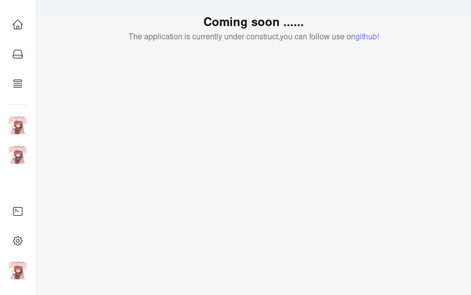

# NOLauncher

NOLauncher, which is referring to \'Not Only launcher\',is a Minecraft launcher which going to provide several functionality as well as beautiful UI. It's built on Rust, Tauri, React and Tailwind CSS. PR is also welcome!

## Why I want to "reinvent the wheel" !
1. The official Minecraft launcher lack of mod support and the speed of downloading assets is too slow!
2. I have used several launcher, include GDLauncher, PrismLauncher, etc, GDLauncher is not maintaining and PrismLauncher doesn't have a good UI, what's more, both of them doesn't have any local server utility.

## Why using tauri ?
1. I want to practice rust, which recently I have learned.
2. I don't like electron.

